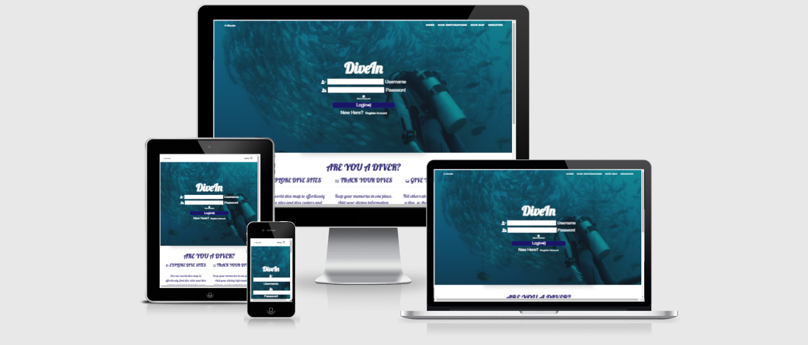

# **DiveIn**

## **Goal for this project** 
DiveIn is a webstie for divers. Here you can find information about awesome dive spots around the world. But not only ccan you find information, you can also rate dives yourself, as well as add a dive spot to the given country. 

Thank you for visiting my project!
If you have any feedback or questions, head over to my GitHub contact details and feel free to reach out to me.

---

## Table of contents 

- [**DiveIn**](#--divein--)
  * [**Goal for this project**](#--goal-for-this-project--)
  * [Table of contents](#table-of-contents)
  * [**UX**](#--ux--)
    + [**User Stories**](#--user-stories--)
      - [User](#user)
      - [Owner](#owner)
      - [User Expectations](#user-expectations)
  * [**Design Choices**](#--design-choices--)
    + [Fonts](#fonts)
    + [Icons](#icons)
    + [Colors](#colors)
    + [Changes made to color scheme](#changes-made-to-color-scheme)
  * [**Structure**](#--structure--)
    + [Home Page](#home-page)
    + [Dive Destinations Page](#dive-destinations-page)
    + [Dive Map Page](#dive-map-page)
    + [Profile Page](#profile-page)
    + [Add Dive Page](#add-dive-page)
    + [Registration Page](#registration-page)
    + [**Wireframes**](#--wireframes--)
    + [Changes made to wireframes](#changes-made-to-wireframes)
      - [Desktop Wireframes](#desktop-wireframes)
      - [Tablet Wireframes](#tablet-wireframes)
      - [Mobile Wireframes](#mobile-wireframes)
    + [Features to be implemented](#features-to-be-implemented)
  * 
  * [**Technologies used**](#--technologies-used--)
    + [Languages](#languages)
    + [Libraries & Frameworks](#libraries---frameworks)
    + [Tools](#tools)
  * 
  * [**Testing**](#--testing--)
      - [User story: As a user I want to be able to find new diving spots.](#user-story--as-a-user-i-want-to-be-able-to-find-new-diving-spots)
      - [User story: As a user I want to be able to showcase my own diving experiences.](#user-story--as-a-user-i-want-to-be-able-to-showcase-my-own-diving-experiences)
      - [User story: As a user I want to se other peoples diving experiences.](#user-story--as-a-user-i-want-to-se-other-peoples-diving-experiences)
      - [User story: As a user I want to be able understand what the website is about very quickly.](#user-story--as-a-user-i-want-to-be-able-understand-what-the-website-is-about-very-quickly)
    + [**Bugs**](#--bugs--)
      - [1 When the user uploaded a photo, the photo would not render on the page.](#1-when-the-user-uploaded-a-photo--the-photo-would-not-render-on-the-page)
      - [2 The Dive destination page would not divide the dives into categories depending on continent using Jinja](#2-the-dive-destination-page-would-not-divide-the-dives-into-categories-depending-on-continent-using-jinja)
      - [3 I accedently added my Google API key to the repository](#3-i-accedently-added-my-google-api-key-to-the-repository)
  * 
  * [**Deployment**](#--deployment--)
    + [Local deployment](#local-deployment)
    + [Using Mongo](#using-mongo)
    + [Deployment to Heroku](#deployment-to-heroku)
  * 
    + [** Credit **](#---credit---)
    + [**Acknowledgements**](#--acknowledgements--)

<small><i><a href='http://ecotrust-canada.github.io/markdown-toc/'>Table of contents generated with markdown-toc</a></i></small>

## **UX**

### **User Stories**

#### User
* As a user I want to be able to find new diving spots
* As a user I want to be able to showcase my own diving experiences
* As a user I want to se other peoples diving experiences
* As a user I want to be able understand what the website is about very quickly

#### Owner
* As a owner I want people to use the Google diving map to find new diving experiences.
* As a owner I want people to sign up as users and populate the website with diving spots.
* As a owner I want the users to quickly be able to navigate through the site.
* As a owner I want to expand the userbase by giving the user interactive solutions on the website.

#### User Expectations
* Easy to navigate.
* Flow of the sign up process takes a short time.
* Understand the purpose of the webiste within a short time.
* Find usefull information within the topic of diving.

(#table-of-contents)
--- 

## **Design Choices**

### Fonts
 I have visited [Google Fonts](https://fonts.google.com/ "Google Fonts") to explore the various options. The font i use in this project are [Lobster] (https://fonts.google.com/specimen/Lobster#standard-styles). The font is italic as has a wavy look, which fits well with the diving theme. 

### Icons
I have used icons from the [Font Awesome library](https://fontawesome.com/ "Font Awesome"). There is a limited amount of icons. But they fit the corresponding text. 

### Colors

You can view my color scheme [here](static/Images/colors.png)

The feel of the website should give you a feeling of the sensation of diving. 

* #fff: Is the primary background color. Many images will be used as backgrounds, but in places where there is not a picture as background, white will be applied.

* #1B1464: Is a smooth dark blue color. It will be used as the primary text color throughout the project.

* #A3DEFF: Is a smooth Light-blue color. It will be used as the dividing color throughout the page. 

* #212529: Is a dark green color. It will be used as overlay in different places. 

I have used contract checker on Coolors in order to make sure that the contract is sufficient.
In this way my content will be easily readable. 

### Changes made to color scheme

I changed the colors from the original outlook, as i think the new colors suit the project better. initially i was thinking of having a blue background and white text, but i came to realize that a white background is more elegant, and the blue text fits very well on it. 

[Back to Top](#table-of-contents)

--- 

## **Structure**
The website structure is built with [Bootstrap](https://getbootstrap.com/).
Bootstrap provides content for both CSS and JavaScript, as functionality with both is important.
As Bootstrap is designed for mobile first, I will be certain that my website functions well on mobile. 

### Home Page
The home page has two functionalities. The most important functionality is the login function. Besides the login function, it is also possible to view the world map and all the dives people add over time. It is kept fairly simple, so the users won't have to many options.

### Dive Destinations Page
Arguably this is the most important page of the project. This is where everyone can go in and read about the different dive sites around the world. All of the entries will be written by users, and you can get a clearer idea to how people experience dive spots. 

### Dive Map Page
The Dive map page essentially has the same functionality as the Map on the home page provides. But here the users will be able to focus solely on the dive map. This is a feature and site that stills needs work. 

### Profile Page
At the profile page the user will be able to add a new dive or edit the dives they have already uploaded. They can also erase dives, if they do not want them anymore. Functionality to edit username and password will be added at a future update. 

### Add Dive Page
The Add Dive page is essentially a form the user fills. Here they put in continent, country, place, description and image of the place. This information is then used to display the dive on the dive destination page. 

### Registration Page
The registration page is very simple. You just put in a username and password. Then the user is created if the username is not used by others. 

### **Wireframes**
I have decided to use [Balsamic](https://balsamiq.com/wireframes/) to create wireframes for my website. 
First I created a wireframe for mobile, as the approach is mobile first. Thereafter wireframes for desktop and tablets. 

### Changes made to wireframes
The initial feel of the website did not feel great, and functionality was hard to produce. So many changes have been made to the wireframes. The home page now contains a login field as the first eye catching thing. Then there is a dive map under. The profile page only contains the dives the user have added, to keep it simple and smooth. The registration page have been simplified to just match the login, and now you just put in a username and password. Login page and country pages have been erased, as they were not needed in the new format. 

You can find my wireframes below:

#### Desktop Wireframes 
* [Home Page](wireframes/desktop/Desktop_home_page.png)
* [Dive Destination page](wireframes/desktop/Desktop_dive_destinations.png)
* [Country page](wireframes/desktop/Desktop_country_page.png)
* [Profile page](wireframes/desktop/Desktop_profile_page.png)
* [Register page](wireframes/desktop/Desktop_register.png)
* [Login page](wireframes/desktop/Desktop_login.png)
* [Add Dive page](wireframes/desktop/Desktop_add_dive_page.png)

#### Tablet Wireframes
* [Home Page](wireframes/tablet/Tablet_home_page.png)
* [Dive Destination page](wireframes/tablet/Tablet_dive_destinations.png)
* [Country page](wireframes/tablet/Tablet_country_page.png)
* [Profile page](wireframes/tablet/Tablet_profile_page.png)
* [Register page](wireframes/tablet/Tablet_register.png)
* [Login page](wireframes/tablet/Tablet_login.png)
* [Add Dive page](wireframes/tablet/Tablet_add_dive_page.png)

#### Mobile Wireframes 
* [Home Page](wireframes/mobile/Mobile_home_page.png)
* [Dive Destination page](wireframes/mobile/Mobile_dive_destinations.png)
* [Country page](wireframes/mobile/Mobile_country_page.png)
* [Profile page](wireframes/mobile/Mobile_profile_page.png)
* [Register page](wireframes/mobile/Mobile_register.png)
* [Login page](wireframes/mobile/Mobile_login.png)
* [Add Dive page](wireframes/mobile/Mobile_add_dive_page.png)

### Features to be implemented

* A heatmap over where diving is good during different seasons.
* Access to store with diving gear.
* community forum, where users can discuss various subjects.

[Back to Top](#table-of-contents)

--- 

## **Technologies used**

### Languages

* [HTML](https://en.wikipedia.org/wiki/HTML)
* [CSS](https://en.wikipedia.org/wiki/Cascading_Style_Sheets)
* [JavaScript](https://en.wikipedia.org/wiki/JavaScript)
* [Python](https://en.wikipedia.org/wiki/Python_(programming_language))

### Libraries & Frameworks

- [Flask](https://flask.palletsprojects.com/) - Python web framework, used for displaying data from backend databases to frontend presentation.
- [Bootstrap](https://getbootstrap.com/) - CSS framework, mainly used for components.
- [jQuery](https://jquery.com/) - JavaScript library, used for refactoring code.
- [MongoDB](https://www.mongodb.com/) - Cloud-based NoSQL database, used for housing data.
- [Google Fonts](https://fonts.google.com/) - Merriweather font used in the design throughout.
- [Google Icons](https://fonts.google.com/icons) - Used in the design throughout.
- [Werkzeug](https://pypi.org/project/Werkzeug/) - WSCI web application library to assist in debugging and security validations.
- [DNSPython](https://pypi.org/project/dnspython/) - DNS toolkit for Python.
- [Flask-PyMongo](https://flask-pymongo.readthedocs.io/en/latest/) - Helpers to bridge Flask and PyMongo.

### Tools
* [Git](https://git-scm.com/)
* [GitPod](https://www.gitpod.io/)
* [Balsamic](https://balsamiq.com/wireframes/)
* [W3C HTML Validation Service](https://validator.w3.org/)
* [W3C CSS Validation Service](https://jigsaw.w3.org/css-validator/) - Some bugs and warnings occure due to materialize. 

[Back to Top](#table-of-contents)

--- 

## **Testing**

#### User story: As a user I want to be able to find new diving spots.
* **Plan**
The plan is to give users new perspectives as to where they can travel for good diving spots. It should feel like a shot of inspiration going through the site. The search functionality has to be easy and simple. 

* **Implementation**
The user will be able to achieve this goal by going to the diving destinations page, as they can there see descriptions of other peoples dives. There they can also search for specific continents or countries, if they have something in mind. 

* **Test**    
When navigating through the site, it is easy to get to the dive destination page. From there it is easy to understand how to use the search function, as it appears in the top of the screen. 

* **Result**  
the 3 users that tested the functionality found it easy to find new inspiration about diving spots, and the navigation came very intuitive to them. 

* **Verdict**  
The test has passed all the criteria and works like planned.

#### User story: As a user I want to be able to showcase my own diving experiences.
* **Plan** 
The user should be able to put in their own experiences with diving, so they can portrait for others what they experiences in the given spot. 

* **Implementation**  
The user should easily be able to get to the Add Dive page, when they log in to their profile. From the profile page it should be simple and easy to understand what they can do. 

* **Test** 
The users should easily be able to navigate to the profile page and from there add their own dives to the database.

* **Result** 
The users that tested the page in general had an easy time getting through to the add dive page and show casing their own dive examples. One user noted that it was a bit confusing they could not add a dive from the Dive Destination page, as it came more intuitve for her. 

* **Verdict** 
The test has passed all the criteria and works like planned.

#### User story: As a user I want to se other peoples diving experiences.
* **Plan** 
The main goal for a user is to get other perspectives about diving. You have maybe read travel guides or "top 10 destinations for diving", but then want personal perspectives from other divers. 

* **Implementation**
To be able to see other peoples diving experiences, the Dive Destination page is the main functionality, as the users will be able to search for inspiration in all the posts people have done over time. 

* **Test**  
The user should navigate to the Dive Destination site, be able to search for dives and intuitively understand what they can search for. 

* **Result** 
The users that tested the page had an easy time finding the Dive Destination site. From there they were able to use the search functionality. One user had difficulties understanding the reset function.

* **Verdict**  
The test has passed all the criteria and works like planned.
 

#### User story: As a user I want to be able understand what the website is about very quickly.
* **Plan** 
As a user it is important to quickly understand what I can do on the page. Therefore navigation and goal has to be easily understood from first go.

* **Implementation**  
The navigation has been kept simple, so the user always have limited steps to take. This has been done, so the user can always easily find the information they are looking for. 
* **Test** 
the users were tasked to try and navigate through the most intuitive path for them. 
* **Result** 
The users navigated through the site without any issues. They found the navigation intuitive to use.
* **Verdict**     
The test has passed all the criteria and works like planned.

### **Bugs**

#### 1 When the user uploaded a photo, the photo would not render on the page.
* **Solution** 

The solution for this project has been to use a URL. I have provided the user a website to turn a image into a direct URL link, and from there they can pass it on to the website. 

#### 2 The Dive destination page would not divide the dives into categories depending on continent using Jinja

* **Solution** 

The issue was that the heading was replicated for each dive using a Jinja for-loop. I took the headings out and put them seperate to the for-loop. 

#### 3 I accedently added my Google API key to the repository

* **Solution**

Sinse then i have regenerated the key, and put ekstra safety meassures in place.

[Back to Top](#table-of-contents)

--- 

## **Deployment**

1. Create project with [Code Institute full template](https://github.com/Code-Institute-Org/gitpod-full-template). 
2. Create new repository from template
3. Open up repository with Gitpod/VSCode/IDE of choice. 

### Local deployment

1. Log into your GitHub account and find the repository.
2. Click on the 'Code' button (next to 'Add file').
3. To clone the repository using HTTPS, under clone with HTTPS, copy the link.
4. Then open Git Bash.
5. Change the current working directory to where you want the cloned directory to be made.
6. In your IDE's terminal type 'git clone' followed by the URL you copied.
7. Press Enter.
8. Your local clone will now be made.

### Using Mongo

1. Create an account with MongoDB.
2. Create a database 'cluster'.
3. Within your newly created cluster, create a database.
4. Within your newly created database, create collections. These collections will store your documents (where the data is housed).
5. Connect your application by clicking 'Connect' in the 'Databases' section.
6. Link up your codebase with MongoDB by adding sensitive variables to your local env.py and config vars in Heroku. 
7. If you're using tech like Flask, you will need to install other dependencies to aid technologies working together.

### Deployment to Heroku

1. Log in to [Heroku](https://www.heroku.com/).
2. Click 'New' on the Dashboard and select 'Create new app'.
3. Select your region and create an app name.
4. Make sure you add all your environment and configuration variables in 'Config Vars' under 'Settings' tab. 
4. Select 'Deploy' option in menu. 
5. Enable automatic deployments from your GitHub by connecting accounts and selecting automatic deployment option. 
6. Click 'Deploy branch' 

[Back to Top](#table-of-contents)

--- 

### ** Credit **
I have drawn much inspiration from different posts on Stackoverflow. Credit is also given to my mentor [Eventyret_mentor](https://github.com/Eventyret), whom have helped me during the project period. 

### **Acknowledgements**
I want to thank the 3 people who tested the website(Andreas, Niels and Susanne). They gave valuable feedback to optimize the structure and feel of the website.

[Back to Top](#table-of-contents)

